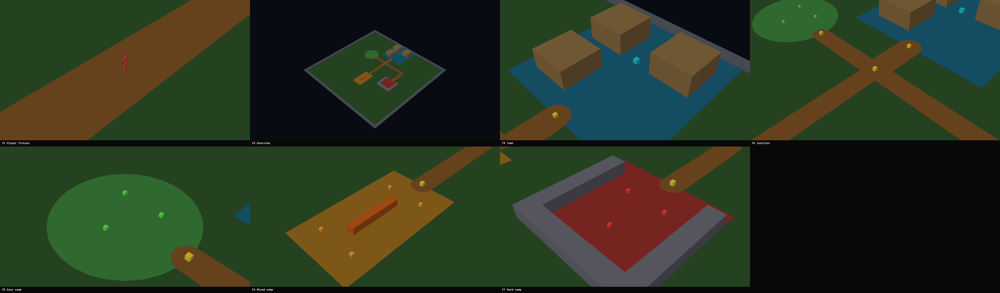

# Deterministic Draft 0 Graybox Capture

On 2026-08-03, Starfall's native SDL GPU client gained deterministic, chrome-free capture of its seven fixed Draft 0 camera presets. This checkpoint records the first complete review sheet generated by the game renderer itself: player fixture, whole-zone overview, town, junction, and the easy, mixed, and hard camps.

## Ownership

- Task: `pm://project/prj_pkIpzx0fzFD4URjvqBuYrGZF/task/CLIENT-0024`
- Project: `prj_pkIpzx0fzFD4URjvqBuYrGZF` (Starfall)
- Capture contract: `pm://project/prj_pkIpzx0fzFD4URjvqBuYrGZF/wiki/development/draft-0-graybox-capture-suite`
- Owner visual validation: accepted on 2026-08-03
- Owner preservation decision: preserve the contact sheet as shown

## Provenance and generation

Starfall.Client rendered seven 1,920 by 1,080 frames through the same graybox and technical-character path as the interactive preview, with `Idle_Loop` sampled at 0.500 seconds. The bounded coordinator helper performed SDL GPU readback and PNG encoding. The coordinator's `scripts/create-contact-sheet.swift` then arranged the byte-validated PNGs in stable F1-F7 order with four columns and one intentionally empty eighth cell.

The technical humanoid and animation derive from the owner-supplied Quaternius Universal Base Characters and Universal Animation Library sources under their recorded CC0 1.0 provenance. The graybox mesh, colours, markers, cameras, and labels are Starfall-generated diagnostic content. No private source package or source-equivalent asset is reproduced here.

Only the curated derivative is retained. The seven raw PNGs and temporary compositor outputs remain outside source control.

## Artifact

- File: `contact-sheet.png`
- Dimensions: 7,680 by 2,256 pixels
- Format: 8-bit RGBA PNG, non-interlaced
- SHA-256: `7b94a01f3b62255c3450f205311252dd444b62a77d19fa5ec01e2cf3dd847095`
