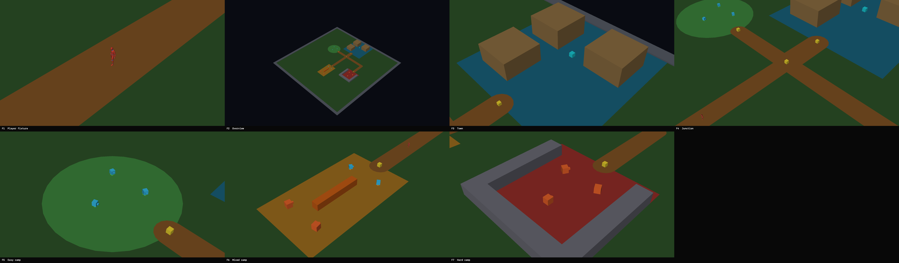

# First Visible Draft 0 Monsters

On 2026-08-05, Starfall's local native SDL GPU preview first populated all three Draft 0 camps. Ten generated, forward-readable box creatures now occupy the exact ordered spawn assignments from the durable starter-monster catalog: cyan light fixtures in the easy camp, a mixed light/heavy population in the divided camp, and orange heavy fixtures in the constrained hard camp.

This checkpoint deliberately records visibility before behavior. The creatures have only deterministic diagnostic facing and gentle client-owned hover; they do not imply authoritative AI, health, combat, connected snapshots, selected monster assets, or airborne gameplay.

## Ownership

- Task: `pm://project/prj_pkIpzx0fzFD4URjvqBuYrGZF/task/CLIENT-0022`
- Project: `prj_pkIpzx0fzFD4URjvqBuYrGZF` (Starfall)
- Content contract: `pm://project/prj_pkIpzx0fzFD4URjvqBuYrGZF/wiki/content/draft-0-starter-flyers-and-camps`
- Owner native validation: accepted on 2026-08-05
- Owner preservation decision: preserve the seven-view contact sheet as shown

## Provenance and generation

Starfall.Client rendered seven 1,920 by 1,080 frames through the same graybox, static-mesh, and technical-character path as the interactive preview. Both character animation and monster hover were sampled at 0.500 seconds. The bounded coordinator capture helper performed SDL GPU readback and PNG encoding, and `scripts/create-contact-sheet.swift` arranged the validated frames in stable F1-F7 order with four columns.

The technical humanoid and animation derive from the owner-supplied Quaternius Universal Base Characters and Universal Animation Library sources under their recorded CC0 1.0 provenance. The graybox, monster geometry, colours, fixture transforms, cameras, markers, and labels are generated diagnostic content owned by Starfall. No selected monster asset or private source package is reproduced here.

Only the curated derivative is retained. The seven raw PNGs and temporary compositor outputs remain outside source control.

## Artifact

- File: `contact-sheet.png`
- Dimensions: 7,680 by 2,256 pixels
- Format: 8-bit RGBA PNG, non-interlaced
- SHA-256: `208f782cd2fbffdc7e972aa77de1265b3a0627b4fb5827e26252bedb9915a286`
