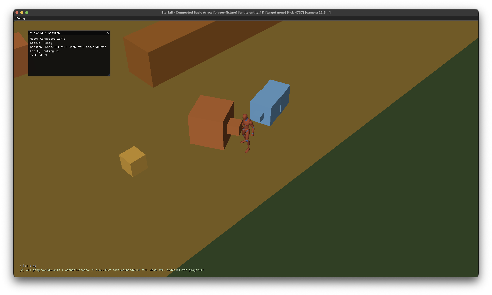

# Connected Development Command Console

On 2026-08-06, Starfall's native connected Client first issued an authoritative development command through its ImGui console. The canonical `ping` command crossed the admitted session on the bounded development-command channels and returned a correlated `pong` containing the active world, channel, tick, session, and player diagnostics.

This checkpoint captures the console after input closed. Its recent command and result remain readable over the game view without an opaque panel or input capture, demonstrating the Minecraft-like transparent transcript state as well as the connected command path. The World / Session window provides the matching admitted-session context. This is engineering instrumentation, not permanent game UI or a production administration interface.

## Ownership

- Task: `pm://project/prj_pkIpzx0fzFD4URjvqBuYrGZF/task/CLIENT-0031`
- Project: `prj_pkIpzx0fzFD4URjvqBuYrGZF` (Starfall)
- Command contract: `pm://project/prj_pkIpzx0fzFD4URjvqBuYrGZF/wiki/protocol/development-commands`
- Owner native validation: accepted on 2026-08-06
- Owner preservation decision: preserve the native window capture as shown

## Provenance and generation

The owner captured the running Starfall macOS ARM64 window after connecting it to a local authoritative World, opening the command console, submitting `ping`, and receiving the correlated success. The native title bar and application chrome are intentionally retained as evidence that this is the real Starfall Client. The surrounding desktop is excluded.

Starfall.Client rendered the technical Quaternius humanoid and generated Draft 0 diagnostic world through the existing SDL GPU presentation path, then recorded the Starfall-owned ImGui shell and console. The technical character derives from owner-supplied Quaternius CC0 source under the existing recorded provenance. The graybox, placeholder monsters, UI, and diagnostics are generated project content. No private source package is reproduced here.

Only this curated PNG is retained. Admission tickets, keys, raw or alternate captures, and temporary files remain ignored and outside project history.

## Artifact

- File: `connected-development-console.png`
- Dimensions: 2,032 by 1,220 pixels
- Format: 8-bit RGBA PNG, non-interlaced
- SHA-256: `7940abe379f82f9948e6625d57f1e36b10ffd95e91469c1abd9b5310b2f21040`
